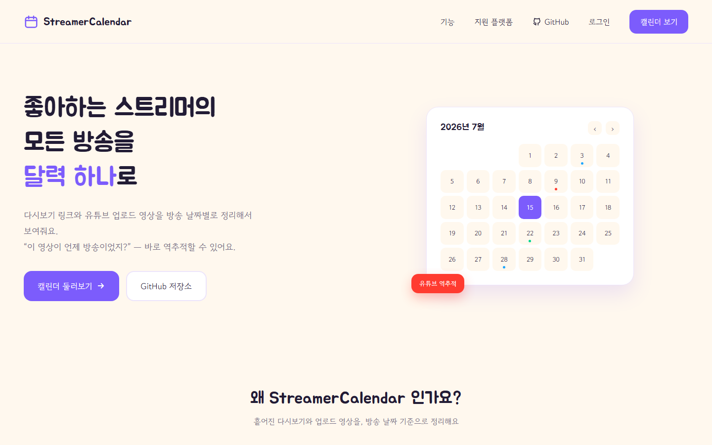
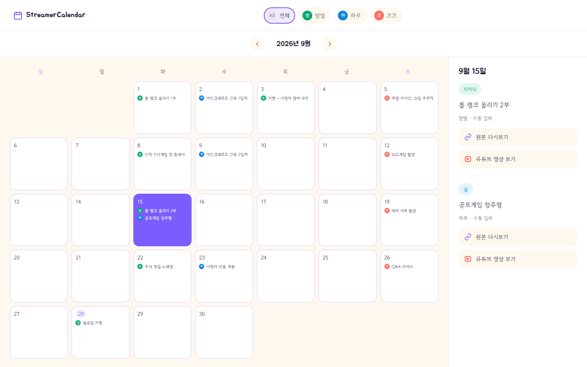
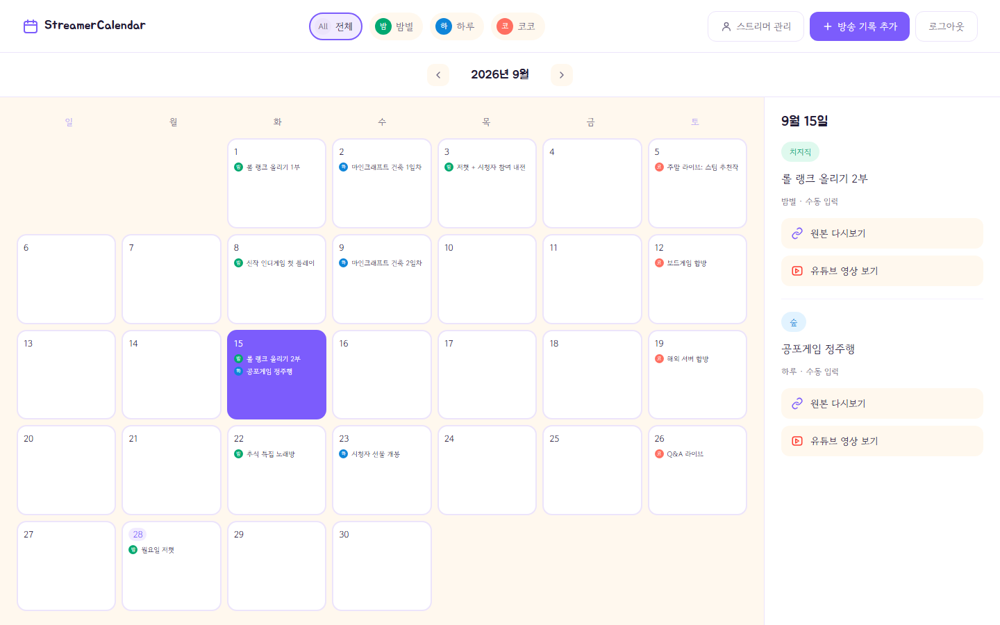
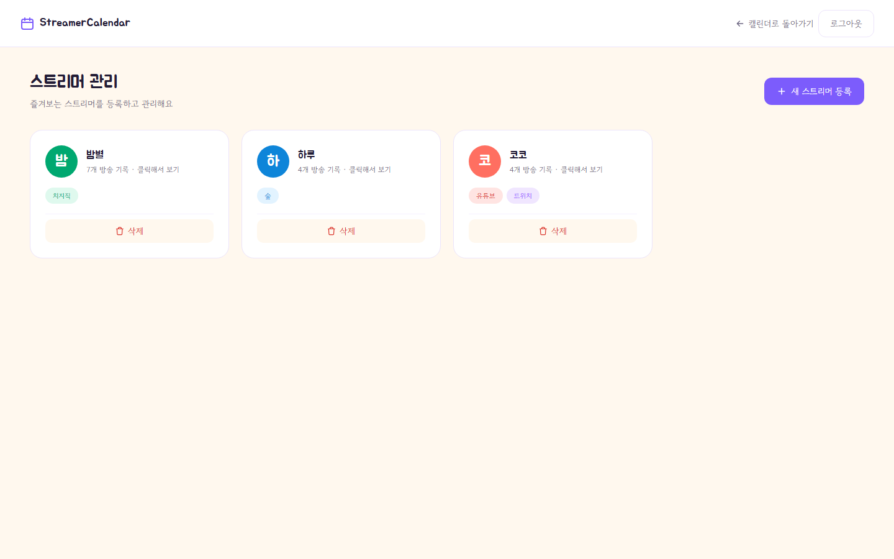
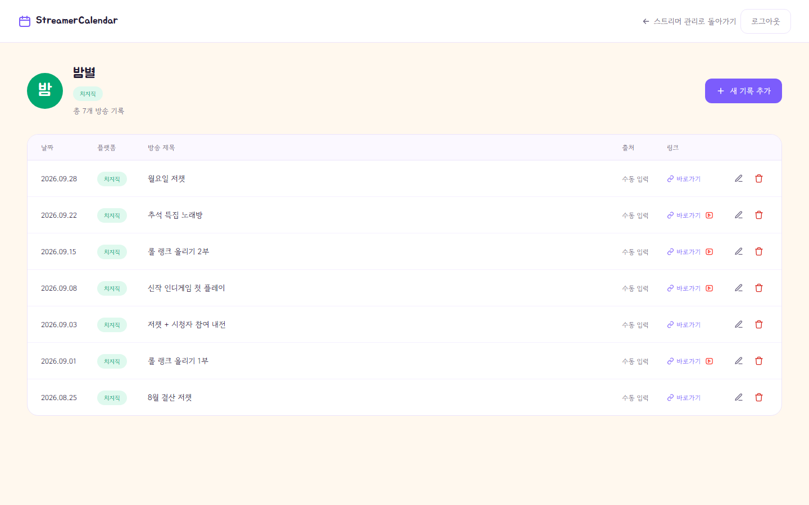
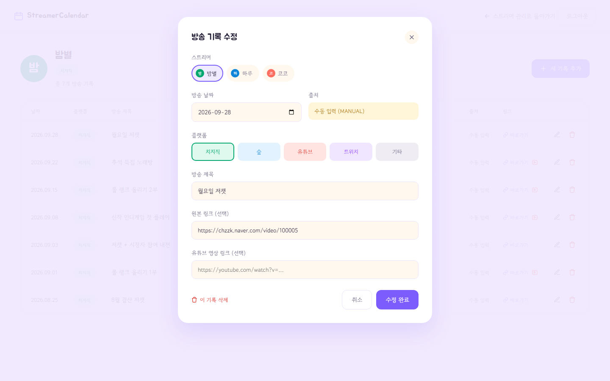
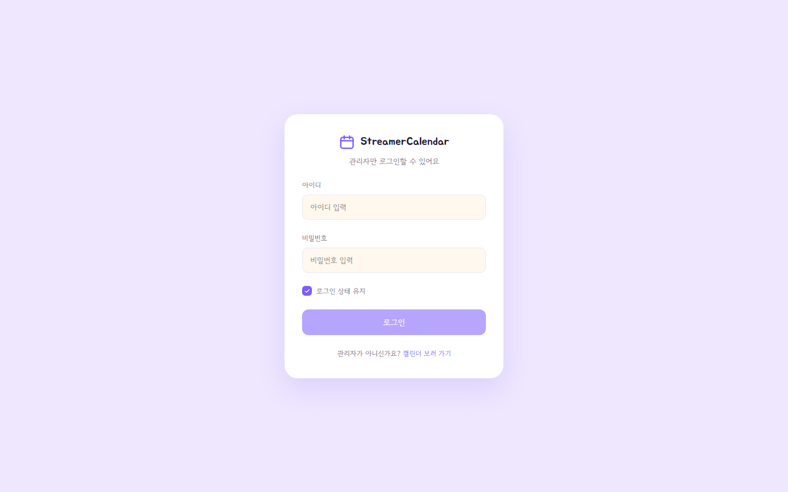

# StreamerCalendar — Frontend

좋아하는 스트리머의 지난 방송을 **달력**으로 모아 보고, 각 방송일에 **원본 다시보기**와 **유튜브 편집 영상**을 연결해 두는 서비스의 프론트엔드입니다.
유튜브 영상을 보다가 "이게 언제 방송이었지?"를 캘린더로 바로 역추적하는 것이 목표입니다.

- **서비스**: https://streamer-calendar-web.vercel.app
- **백엔드 저장소**: https://github.com/johnch94/StreamerCalendar (API · 인증 · 쿼리 개선 · 배포 구성)

> API 서버가 Render 무료 플랜이라 15분 동안 요청이 없으면 잠듭니다. 첫 접속 때 데이터가 30~60초 늦게 뜰 수 있어요.



## 화면

### 캘린더 (사용자)
월별로 방송이 있던 날을 보여주고, 날짜를 누르면 오른쪽 패널에 그날 방송의 **원본 다시보기**와 **유튜브 영상** 링크가 나옵니다. 스트리머별 필터를 지원하고, 보고 있는 달과 필터가 URL(`?year=&month=&streamer=`)에 남아서 그대로 공유할 수 있습니다.



### 관리자 화면
관리자로 로그인하면 같은 캘린더에 **스트리머 관리 · 방송 기록 추가 · 로그아웃** 버튼이 나타납니다.



| 스트리머 관리 | 스트리머별 방송 기록 |
| --- | --- |
|  |  |

| 방송 기록 수정 모달 | 관리자 로그인 |
| --- | --- |
|  |  |

> 스크린샷의 스트리머와 방송은 모두 가상의 예시 데이터입니다.

## 기술 스택

| 구분 | 사용 기술 |
| --- | --- |
| Framework | React 19, Vite 8 |
| Routing | react-router 8 |
| Style | CSS (디자인 토큰 + 페이지별 CSS), Google Fonts (Jua, Gowun Dodum) |
| Lint | ESLint (react-hooks, react-refresh) |
| Deploy | Vercel (`/api`는 Render 백엔드로 프록시) |

캘린더는 라이브러리 없이 직접 구현했습니다 (`utils/date.js`의 월 그리드 계산).

## 접근 구조

| 대상 | 경로 | 화면 |
| --- | --- | --- |
| 사용자 | `/` | 랜딩 (포트폴리오 소개) |
| 사용자 | `/calendar` | 캘린더 (조회 전용) |
| 관리자 | `/admin/login` | 로그인 (로그인 상태 유지 지원) |
| 관리자 · 로그인 필요 | `/admin/streamers` | 스트리머 등록 · 삭제 |
| 관리자 · 로그인 필요 | `/admin/streamers/:streamerId` | 방송 기록 추가 · 수정 · 삭제 |

- `/admin` 하위는 `RequireAdmin` 라우트 가드가 로그인 여부를 확인합니다. 로그인하지 않았으면 로그인 페이지로 보내고, 로그인하면 원래 가려던 주소로 돌려보냅니다.
- 로그인 상태는 `AuthProvider`가 앱 시작 시 `GET /api/auth/me`로 확인합니다. 관리 중 세션이 만료돼 API가 401을 주면 로그아웃 상태로 바뀝니다.
- 버튼 숨김은 사용성을 위한 것이고, **실제 권한 체크는 백엔드(Spring Security)가 합니다.**

## 구현 포인트

- **같은 도메인 구조:** 운영에서는 Vercel `rewrites`로, 개발에서는 Vite proxy로 `/api`를 백엔드에 넘깁니다. 브라우저 입장에서 API가 같은 도메인이라 세션 쿠키(`HttpOnly`, `SameSite=Lax`)를 그대로 쓰고 CORS 설정이 필요 없습니다. 환경변수도 필요 없습니다.
- **데이터 페칭 훅**(`useStreams`, `useStreamers`)
  - 월을 빠르게 넘길 때 늦게 도착한 이전 응답이 화면을 덮어쓰지 않도록, 응답에 조회 조건을 함께 저장하고 effect cleanup에서 무시 플래그를 세웁니다.
  - effect 안에서 setState를 동기로 호출하지 않아 react-hooks 린트 규칙을 지킵니다.
- **폼:** 등록에 실패해도 입력값을 유지하고, 서버의 에러 메시지(`{ code, message }`)를 그대로 보여줍니다. 방송 기록 모달 하나로 추가 · 수정 · 삭제를 모두 처리합니다.
- **스트리머 삭제 확인:** 백엔드가 연관 방송 기록을 함께 삭제하므로 "방송 기록 N건도 함께 삭제돼요"라고 미리 경고합니다.
- **접근성:** 날짜 칸에 `aria-label`("9월 15일, 방송 기록 2건")과 `aria-pressed`를 달았고, 모달은 ESC와 바깥 클릭으로 닫힙니다.
- **반응형:** 1100 / 900 / 720px 기준으로 레이아웃을 바꿉니다. 좁은 화면에서는 상세 패널이 캘린더 아래로 내려갑니다.

## 디렉터리 구조

```
src/
├── api/          fetch 래퍼(client.js: 에러 파싱, 쿠키 포함, 세션 만료 이벤트), auth / streamers / streams
├── auth/         AuthProvider, RequireAdmin(라우트 가드), LogoutButton
├── components/
│   ├── calendar/ MonthCalendar, CalendarHeader, CalendarCell
│   ├── stream/   StreamRecordModal, StreamRecordForm, StreamDetailPanel
│   ├── streamer/ StreamerForm, StreamerList
│   └── common/   Icon, Logo, Modal, PlatformBadge, StreamerAvatar
├── constants/    플랫폼 · 출처 enum과 라벨 · 색상
├── hooks/        useStreams, useStreamers, useAuth
├── pages/        LandingPage, CalendarPage, AdminLoginPage, StreamerPage, StreamerRecordsPage
└── utils/        date.js(월 그리드 · 날짜 포맷), streamer.js(색상 · 이니셜 · 플랫폼 정렬)
```

## 로컬 실행

**준비물:** Node.js 20.19+ 또는 22.12+, 백엔드 서버(`localhost:8080`, [실행 방법](https://github.com/johnch94/StreamerCalendar#로컬-실행))

```bash
npm install
npm run dev      # http://localhost:5173 (/api → localhost:8080 프록시)
npm run lint
npm run build
```

## 배포 (Vercel)

저장소를 Vercel에 연결하면 `main`에 푸시할 때마다 자동으로 배포됩니다. `vercel.json`이 두 가지를 처리합니다.

- `/api/*` → Render 백엔드(`https://streamercalendar.onrender.com`)로 프록시
- 그 밖의 경로 → `index.html` (SPA 라우팅이라 `/admin/streamers`에서 새로고침해도 404가 나지 않음)

## 로드맵

- [ ] Vitest + React Testing Library 테스트
- [ ] 캘린더 상세 패널에서 바로 수정, 선택한 날짜를 URL에 반영(`?date=`)
- [ ] 모달 포커스 트랩
- [ ] **Phase 2**: 유튜브 업로드 영상 후보 큐 관리 화면 (방송 선택해서 매칭 / 무시)
